## Abstract

- Using "Poisson Image Editing" technique from `SigGraph 2004` to make two images fuse together.
- 已知target的被贴图区域的边缘一圈的像素值，以及贴图的散度，使用拉普拉斯算子，运用泊松方程求出融合图像被贴图区域的像素值。使用共轭梯度法求解，并使用稀疏矩阵运算库`scipy`进行加速。
  - 注意：对于图片融合任务，我们使用三个图片进行一次融合，分别是source（源图像）、mask（即源图像ROI部分的掩膜）、target（待插入贴图的图像），我们将源图像ROI部分称为贴图。

## Keyword

- Poisson Equation
- Laplacian Operator
- Sparse Matrix
- Conjugate Gradient Iteration

## Principle

### **泊松方程**

- [泊松方程](https://zh.wikipedia.org/wiki/%E6%B3%8A%E6%9D%BE%E6%96%B9%E7%A8%8B)是数学中的一个常见的**偏微分方程**。

- 公式：$\Delta f = \Omega$
  - **梯度**：一阶微分（离散形式)

  

  - **散度**：二阶微分（离散形式)

  

  - 随着h->0，式子的值也越来越逼近微分结果，而对于离散形式的图片来说，h最小为1，即相邻像素的距离。因此，二阶微分可以转换成如下卷积的形式：

    - 一维

      

    - 二维，又称**拉普拉斯卷积核**

      

### 偏微分方程

- [WIKI](https://zh.wikipedia.org/wiki/%E5%81%8F%E5%BE%AE%E5%88%86%E6%96%B9%E7%A8%8B)
- Partial Differential Equation，简称PDE。
- 指含有未知函数及其偏导数的方程，符合这个关系的函数是这个方程的解。

### 梯度共轭法

- [WIKI](https://zh.wikipedia.org/wiki/%E5%85%B1%E8%BD%AD%E6%A2%AF%E5%BA%A6%E6%B3%95)
- 适用于系数矩阵为**实正定对称的稀疏矩阵**的线性方程组的求解。

## Mathematics

1. 设原图为4 * 4矩阵，其ROI为中间2 * 2的小矩形区域，构建泊松方程。

   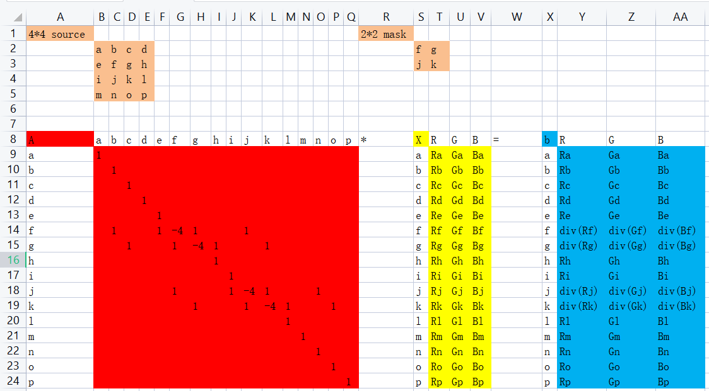

2. 因为需要使用梯度共轭法求解方程，这要求系数矩阵是实正定对称的稀疏矩阵，故对方程进行一定的等价变换。

   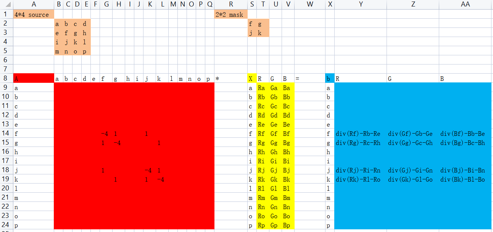

3. 注意，如果令内部区域为不规则图形，如将f-g-i作为内部区域，则更有助于理解方程的等价变换之后代码应该怎么写。这里留给读者自行验证。

## Coding

- 文件目录结构
  - docs：存放报告文档
  - imgs：存放使用的图像
  - source：存放工程代码
    - utils：存放实验参数以及各种脚本。
      - `args.py`：实验参数，供main.py使用
      - `createMask.py`：生成mask的脚本。
    - `main.py`：主函数，进行泊松编辑
    - `PIE.py`：泊松编辑的实现类

1. 第一个问题，贴图内部像素值太大，且边缘有毛刺。

   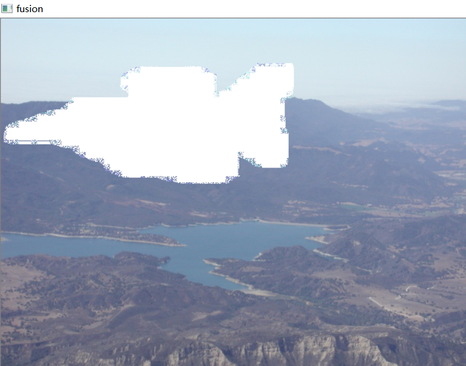

2. 毛刺显然可以通过改变mask的判断方式解决，即将mask图中偏向于黑色的像素全部算作mask，属于数据层面的不严谨；而颜色全都过大则是由于读入的图片在进行计算时会出现溢出，导致结果不准确，可以通过强制类型转换破除计算过程中像素值为0-255的限制。

   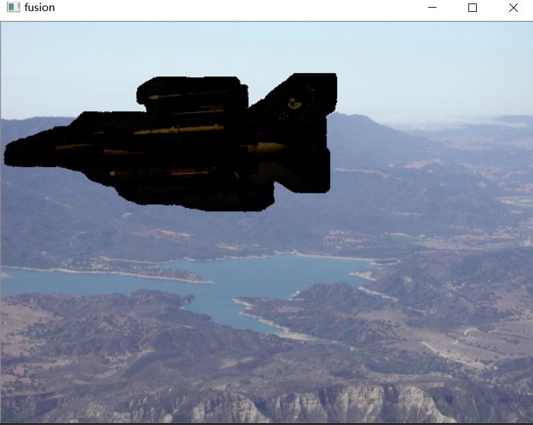

3. 最后这个bug比较难找，经观察，泊松方程解出的解非常小。再观察系数矩阵A和值矩阵b，发现b的值非常小，应该是边缘部分的真实值没有成功过渡给b。最终成功找出代码错误，完成复现。

   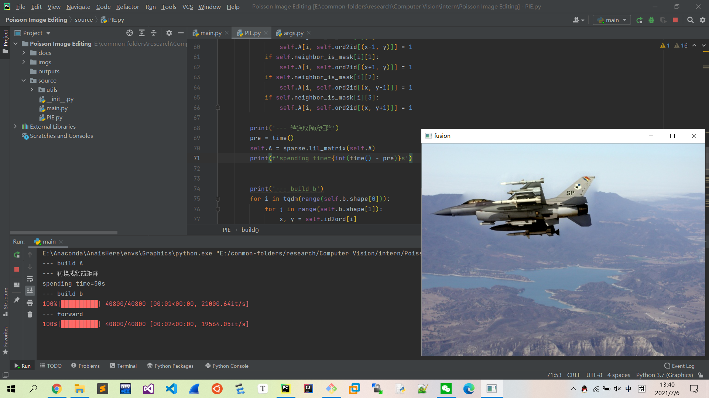

4. 检查调整target图片ROI区域的代码正确性。

   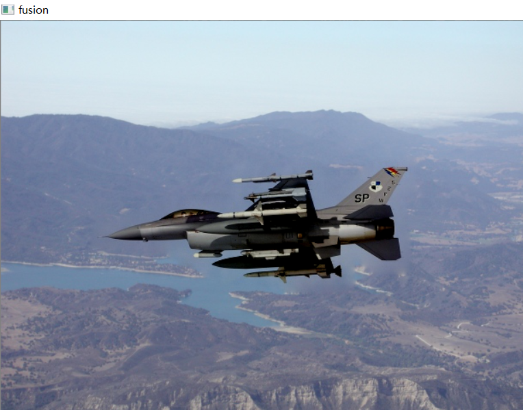

5. 检查其它图片示例的代码正确性。

   1. mona
   
      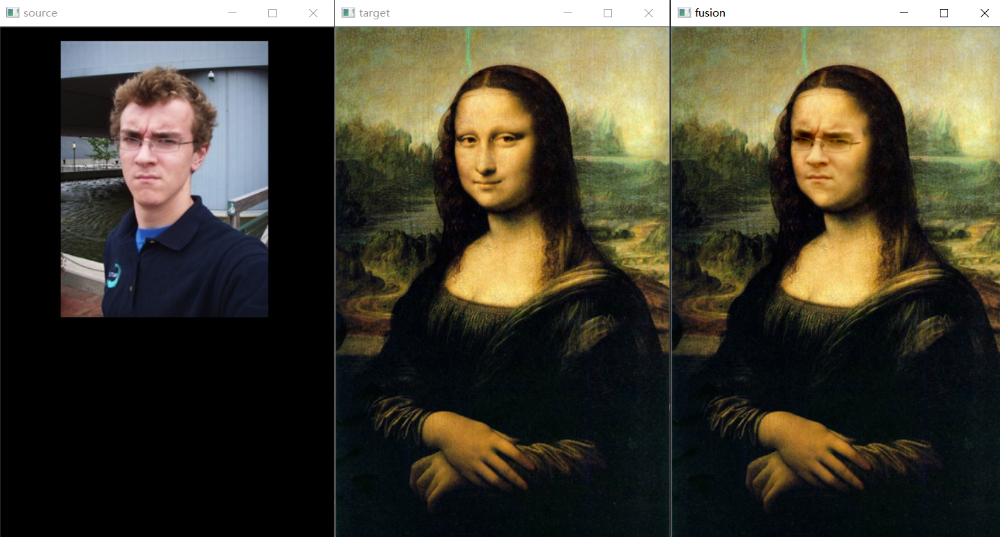
   
   2. sealion
   
      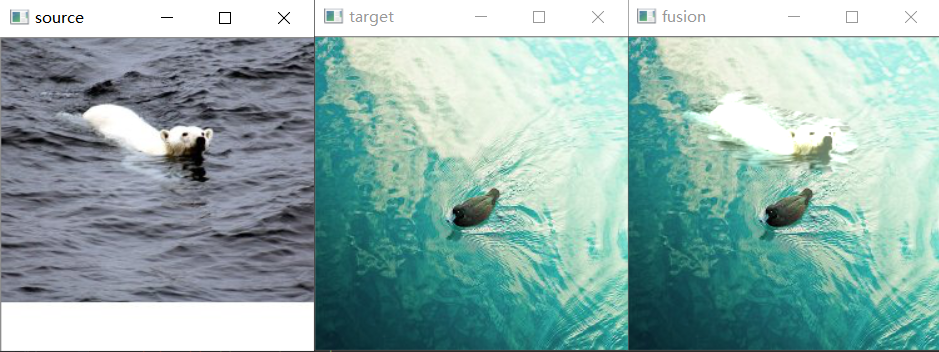
   
   3. bear
   
      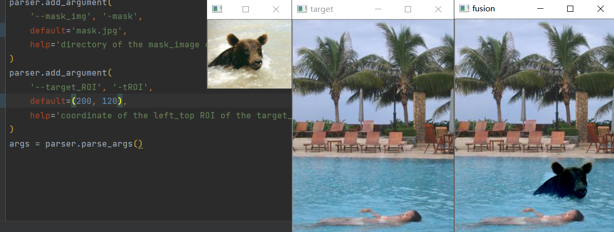
   
   4. eagle
   
      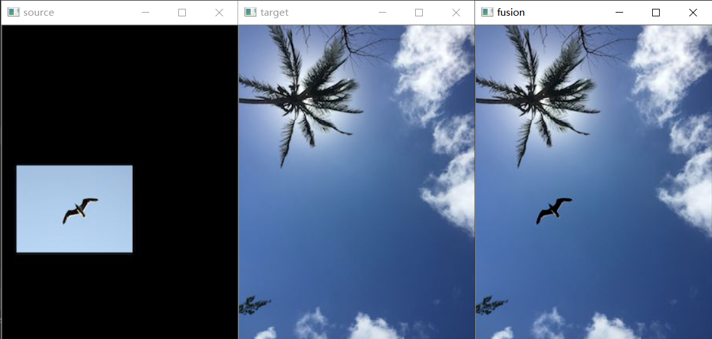

6. 制作mask绘制工具

   1. 首先读入一张source图片并显示。

   2. 捕获用户鼠标动作，用户长按鼠标左键进行拖拽，绘制出轮廓线。

      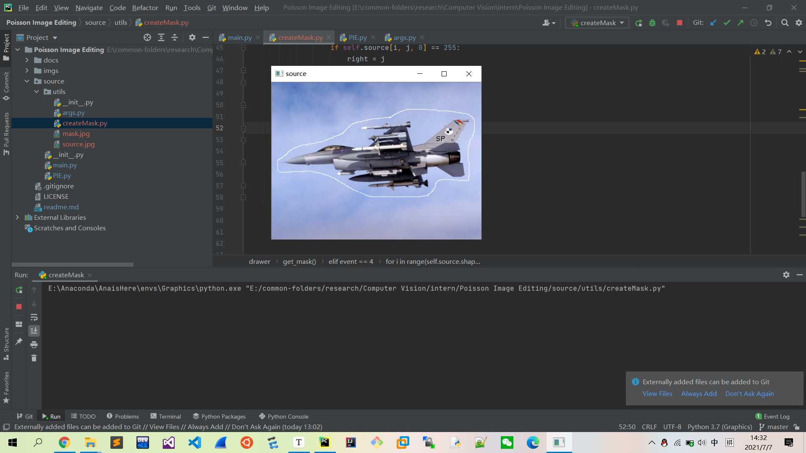

   3. 用户释放鼠标左键后，生成mask图片，并存储。

      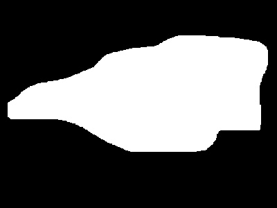

   4. 验证生成mask的正确性。

      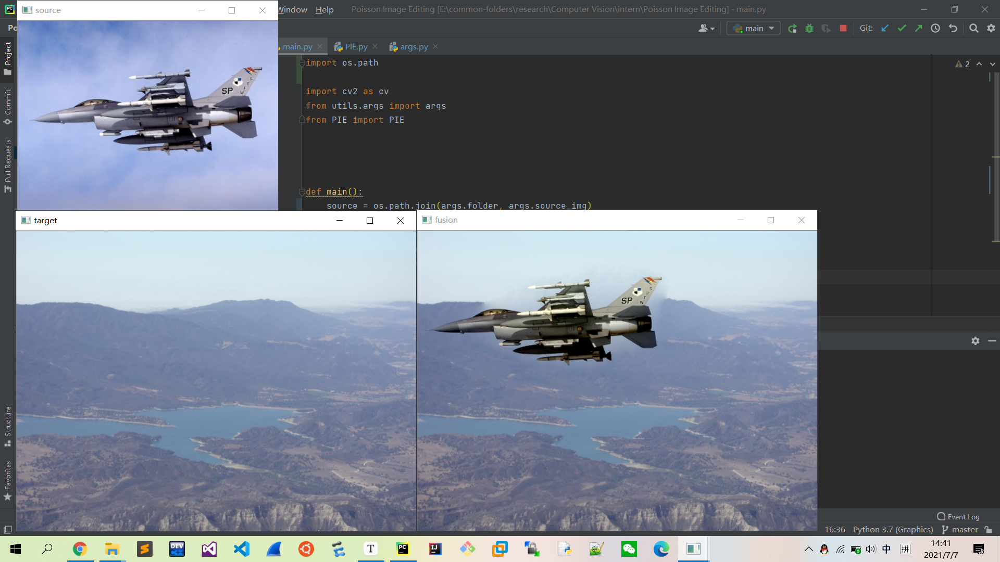

## Conclusion

- ~~从飞机的融合图片可以看出来贴图周围有明显的泛白，但是鹰的融合图片又没有这个问题，应继续对数值运算部分进行debug。~~通过使用mask生成工具进行验证，发现飞机的周围的泛白是原图飞机周围的云雾，由于原图的mask不够精细，贴图时引入了目标图中本不存在的云雾。

## References

- [Poisson Image Editing](https://www.cs.jhu.edu/~misha/Fall07/Papers/Perez03.pdf)
- [从泊松方程的解法，聊到泊松图像融合](https://zhuanlan.zhihu.com/p/68349210)
- [Seamless cloning](https://blog.csdn.net/hjimce/article/details/45716603)
- [Code of huajh](https://github.com/huajh/Poisson_image_editing)
- [opencv鼠标绘图](https://blog.csdn.net/tengfei461807914/article/details/62438959)

